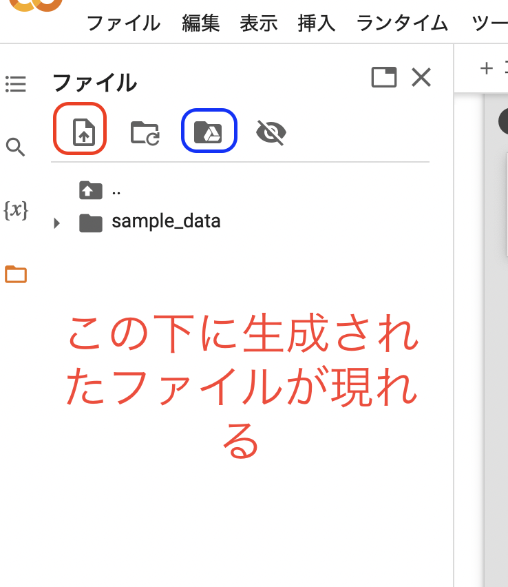
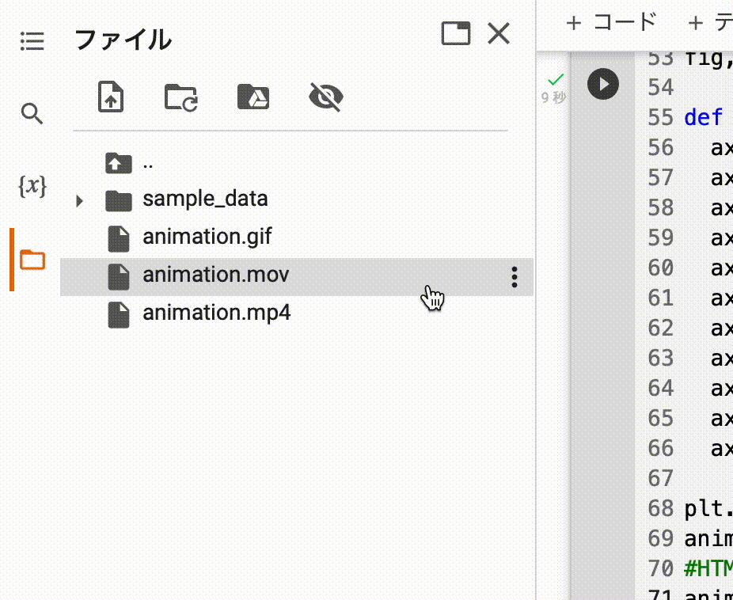

<script src="main.js"></script>

<script type="text/javascript" id="MathJax-script" async=""
	src="https://cdn.jsdelivr.net/npm/mathjax@3/es5/tex-mml-chtml.js">
</script>
<script>
	MathJax = {
		loader: { load: ['[tex]/physics', '[tex]/newcommand', '[tex]/mathtools'] },
				tex: {
					inlineMath: [['$', '$'], ['\\(', '\\)']],
					packages: { '[+]': ['physics', 'newcommand', 'mathtools'] },
				},
				chtml: {
					matchFontHeight: false
				}
			};
</script>
@media only screen and (max-width: 750px) {
    img { max-width: 100%; }
}
<style>
img{
max-height:300px
}
video{
max-height:300px
}
</style>


# googlecolabでできるファイル形式の変換

- [googlecolabでできるファイル形式の変換](#googlecolabでできるファイル形式の変換)
	- [google colabの基本操作](#google-colabの基本操作)
	- [pandoc](#pandoc)
	- [Cloud LaTeX](#cloud-latex)
	- [jupyter-nbconvert](#jupyter-nbconvert)
	- [ffmpeg](#ffmpeg)

## google colabの基本操作

今から書く内容ではターミナルコマンド（シェルコマンド？正確にはなんていうのかわからない）を使うのでcolaboratoryでは通常のpythonのコマンドと異なり頭に`!`を必ずつけることに注意する。



赤いところからローカルのファイルをアップロード、青いところからgoogle driveをマウントする。



google colabに作ったファイルはダウンロードしないと開けない（開きにくい）様になってるのでファイルを右クリックしてダウンロードする。なおファイルを入れたのに入力して`file not found`みたいなエラーが出たらファイルの場所がわからないということなので「パスをコピー」からパスをコピーして貼り付ける。

## pandoc

pandoc使うと書類のフォーマット変換が結構できる。30種類くらい対応しているらしい。使えそうなものだけでもpdf,markdown,latex,docx,pptx,html,ipynb等がある。

文法は至って簡単で例えば`input.md`から`output.html`を出力したければ
```python
!pandoc input.md -s -o output.html
```
とすればよい。なお変換しても`input.md`は消去されない。

とはいえこれだけだと例えばmarkdown->latex->pdfとしたいときに結構できないことがある。（日本語を含んでいるため）もしmarkdownをpdfにしたければmarkdown->html->pdf（htmlからは普通に`cmd+P`（いわゆる「プリント」）からできる）そうしたくない人、latexの見栄えが欲しい人は次のxelatexをいずれかの方法でコンパイルしてpdfを作ればよい。

## Cloud LaTeX 

これに限定すればCloudLaTeXの方が手っ取り早いのでこっちを使う。Cloud LaTeXを使い始める方法自体は[LaTeXを始める](https://yumannimac.github.io/LaTeX_intro/)を参照。

<video controls controles poster="">
<source src="./Conversion_sfiles/SS_6.mov">
</source>
</video>

動画のようにデフォルトでは`xelatex`として出力される仕様なので
- xelatexをコンパイラにする
- `\documentclass{article}`を`\documentclass[xelatex,ja=standard,a4paper]{bxjsarticle}`に変えることに注意する

ように自分で変換する必要がある。


## jupyter-nbconvert 
[ブラウザ上でipynbファイルをエクスポートする](https://yumannimac.github.io/nbconvert_bibouroku/)も参照。ipynbファイルをpdf,markdown,latex,docx,pptx,htmlなどに変換する。コマンドは例えば`input.ipynb`をhtmlにしたければ
```python
!jupyter-nbconvert input.ipynb --to html
```
のようにする。ipynbは要するにmarkdownなのでpandocと同じくらい広く変換できる。

## ffmpeg 

個人的に一番ありがたいのがこれ。というのも例えば  
`.mov`->`.gif`  
にするような操作は有料アプリを入れないとできないと思い込んでしまうことが多いからである。無論CUIではあるもののffmpegを使えば無料で行うことができる操作である。

例えばスクリーンショットで撮った`input.mov`をfps（一秒あたりのフレーム数）10にして`output.gif`にしたければ
```python
!ffmpeg -i input.mov -r 10 output.gif
```
とする。fpsが小さいほど粗くなる。`output.mp4`にしたければ
```python
!ffmpeg -i input.mov output.mp4
```
とする。


<script src="https://blz-soft.github.io/md_style/release/v1.2/md_style.js" ></script>
